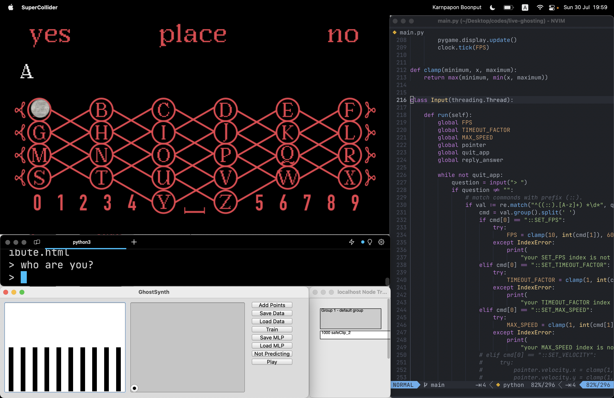

# ouaja

ouaja (วาจา, /waː˧.t͡ɕaː˧/ pronouced as 'waa-jaa', a Thai word for "speech" ), a tool for live (ghosting) performance.

# usage

run `python3 main.py --ip 127.0.0.1 --port 57120`

# commands

you can type these commands while the program is running

- `::SET_FPS <frame>`, set framerate (will be clampped to a range between 10-60fps)
- `::TIMEOUT_FACTOR <factor>`, set timeout (waiting time before moving another letter) (will be clampped to a range between 1-8)
- `::SET_MAX_SPEED <speed>`, set max speed (will be clampped to a range between 1-200)
- `::BREAK`, stop printing answer
- `::BYE`, quit program

# structures

- `/dataset`, a pre-trained neural-network data for using in `synth.scd`
- `synth.scd`, a synth engine ([`FluCoMa`](https://github.com/flucoma/flucoma-sc) lib is required)
- `nano-setup.scd`, a setup for controlling SuperCollider fx chain params.
- `converstaion.txt`, a conversation logs.

# prerequisites

- Korg - NanoKontrol1
- OpenAI API
