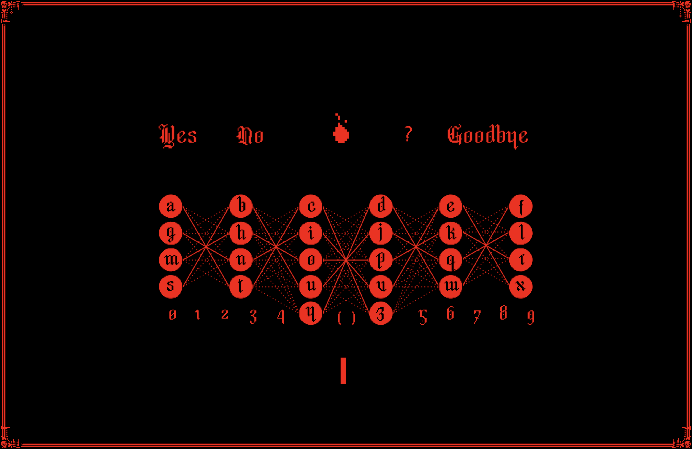

# ouaja

ouaja (วาจา, /waː˧.t͡ɕaː˧/ pronouced as 'waa-jaa', a Thai word for "speech" ).

NOTE: This tool is intended for live performance, So it's an audio-engine agnostic by design (I'm using `SuperCollider`). You'll need to supply your own preferred audio engine backend.

## prerequisites
- `OpenAI` API token
- [`uv`](https://docs.astral.sh/uv/getting-started/installation/), a python package
- OPTIONAL [`SuperCollider`](https://supercollider.github.io/), audio engine
  - [`FluCoMa`](https://github.com/flucoma/flucoma-sc), additional algorithms 
  - [`ddwMixerChannel`](https://github.com/jamshark70/ddwMixerChannel), mixer channel

## usage

- Run `cp .env.example .env` to create a `.env` file from the example.
- Add your `API token` to the `.env` file.
- Add details or the `CONTEXT_CHARACTER` to `.env` (an example prompt is provided in `.env.example`).
- Run `uv sync`.
- Activate the virtual environment with `source .venv/bin/activate`.
- Start the application with `python main.py`. The default port is `57120`; to configure the IP/port, use, for example, `python main.py --ip 127.0.0.1 --port 8080`.
- OPTIONAL: If you do not have an `API Token` but want to see how it works, run `DEBUG=true python main.py` instead of `python main.py`.
- Run `sound-engine.scd` or your preferred audio engine.

## game usage
- To enter the main screen, type the following sentence **exactly as shown**, including all spaces and punctuation: `Signal the trace. We are listening...`

## OSC Msg
to communicate with audio engine i'm using OSC, here's my currently used OSC msg list 
- `/synth_shot_opening`
- `/synth_shot`
- `/synth_coord`
- `/synth_shot_nodes`

## Shortcut
- `Ctrl + f`, toggle fullscreen 

## Commands

- `;;set_fps`
- `;;set_timeout_factor`
- `;;set_move_mode`
- `;;set_trigger_mode`
- `;;set_haunted_mode`
- `;;set_haunted_mode_lower_bound`
- `;;set_haunted_mode_upper_bound`
- `;;move_to`
- `;;set_activate_nodes`
- `;;set_max_speed`
- `;;stop`
- `;;bye`

# Credits
- `Nicer Nightie` font,  https://unfilledflag.itch.io/nicer-nightie
- `hexany`, UI panel https://hexany-ives.itch.io/hexanys-1-bit-ui-panels
- `Free Smoke Fx Pixel 2`, spritesheet https://bdragon1727.itch.io/free-smoke-fx-pixel-2